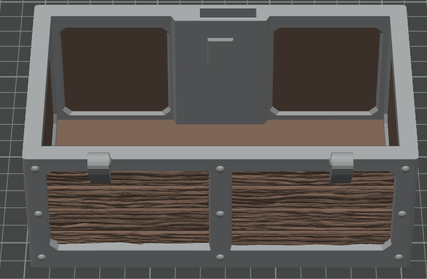
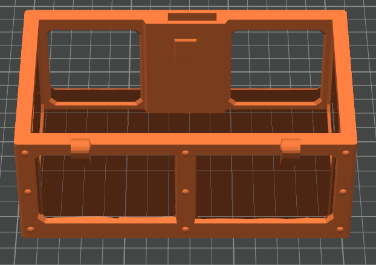
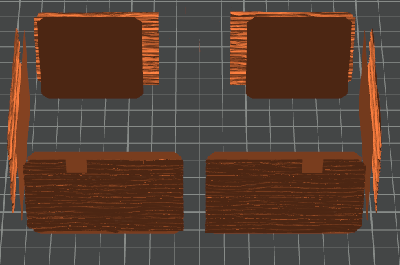

# ColorSplit Enhanced

Split 3MF files by paint color/material into separate components.

## Features

- Extract paint color information from 3MF files
- Split multi-color models into individual components
- Export as STL, OBJ, or PLY files
- Command line and programmatic API

### Visual Example

In this example we use a Makerworld remix of
- https://github.com/DrLex0/print3D-hinged-locked-treasure-chest
- https://makerworld.com/en/models/910440-hinged-locked-treasure-chest#profileId-1490628



The Makerworld version is a .3mf painted in Bambu Studio
Which is what we want.




*The tool automatically detects paint colors in 3MF files and creates separate files for each color group, making it easy to print different parts in different colors or materials.*

## Installation

```bash
uv pip install .
```

## Quick Start

```bash
# Split a 3MF file by color
python color_split_enhanced.py Hinged-Locked-Chest_MultiColor.3mf

# Show color info only
python color_split_enhanced.py input.3mf --info

# Custom output
python color_split_enhanced.py input.3mf -o my_output -f obj
```

## Programmatic Usage

```python
from color_split_enhanced import EnhancedColorSplitter

splitter = EnhancedColorSplitter("input.3mf")
splitter.load_3mf()
splitter.export_split_meshes("output", "stl")
```

## Arguments

- `input_file`: 3MF file to process
- `-o, --output`: Output directory (default: output)
- `-f, --format`: Format: stl, obj, ply (default: stl)
- `--info`: Show info only, don't export

## Output

Files named: `{original_name}_{color_key}.{format}`

Example: `Hinged-Locked-Chest_MultiColor_paint_color_1.stl`

## Dependencies

- trimesh, numpy, matplotlib, open3d